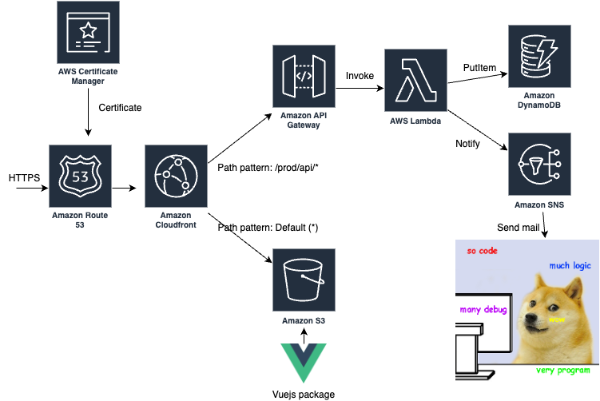

# aws-demo
A demo project to test the technical stack on AWS, including Route 53, API Gateway, CloudFront, S3 website hosting, and serverless Lambda functions.

# Prerequisite
## Dependency: 
 - Terraform v1.7.2
 - aws-cli/2.15.16
 - Vuejs v3.4.29
 - Typescrpt v5.4.0

# Deployment
 - Create an S3 bucket to store the Terraform tfstate file and update the configuration in backend.tf accordingly.
 - Create a custom domain name and modify the corresponding configuration in variable.tf.
 - Configure credentials for programmatic access via the AWS CLI.
 - Run the script deploy.sh.
